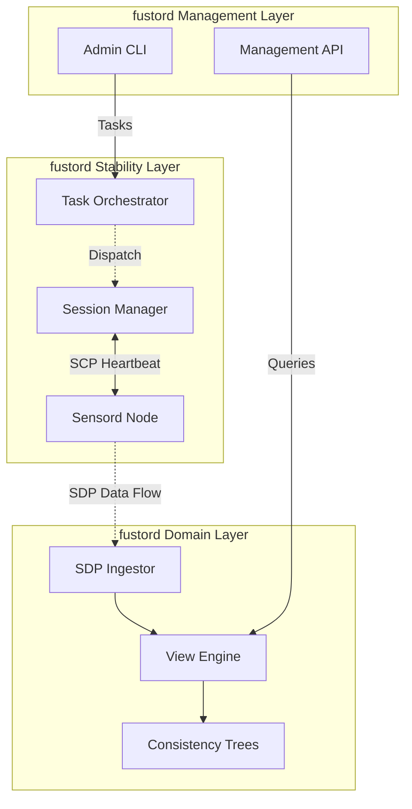

# L0: [fustord] Project Vision

> **Core Purpose**: Define the strategic vision for **fustord**, the centralized aggregator and synchronization arbitrator of the Fustor ecosystem.
> All spec statements must trace back to items defined here.

## VISION.SCOPE

**fustord** is a centralized data aggregation and consistency arbitration engine. It serves as the "truth anchor" for distributed data states collected by autonomous **Sensord** nodes.

### In-Scope
- **AGGREGATION**: Unified indexing of metadata from multiple heterogeneous **Sensord** sources.
- **CONSISTENCY**: Multi-source arbitration using Tombstone, Suspect, and Blind-spot mechanisms.
- **AVAILABILITY**: "Presence is Service" — The API must never return 503; it performs On-Command Fallback scans if data is missing.
- **RESILIENCE**: fustord and its View Engine must stay operational regardless of individual Sensord failures or network partitions.
- **ORCHESTRATION**: Centralized fleet management (upgrades, config reloads) of connected Sensord nodes via SCP.
- **EXTENSIBILITY**: Support for pluggable View Drivers (FS, Forest, Search, etc.) to project data into different business views.

### Out-of-Scope
- **STORAGE**: fustord does NOT store user file contents; it persists and serves metadata views.
- **AUTH_PROXY**: fustord does NOT act as a general authentication proxy; it uses API key-based pipe authorization for backend service-to-service communication.

## VISION.SURVIVAL

> "The View must survive the Source."

The fundamental architectural goal of **fustord** is the **absolute decoupling of View State from Source Reliability**.

- **FUSTORD_SURVIVAL**: Once the fustord process starts, it **MUST NOT** terminate due to ingestion errors, invalid data frames, or malformed protocol packets. It is the indestructible anchor of the system.
- **VIEW_ISOLATION**: Failure in one View (e.g., a memory leak in a specific plugin) must not affect the stability of the Management API or other unrelated Views.
- **UMBILICAL_CONTROL**: fustord maintains the "Umbilical Cord" (SCP Tunnel) to every Sensord. As long as this control plane is intact, fustord can:
  1. **Remediate**: Detect "brain-dead" sensors and issue remote restart commands.
  2. **Upgrade**: Push software updates to the fleet without manual intervention.
  3. **Reconfigure**: Hot-reload sensor configurations to adapt to changing storage environments.

### Architecture of Separation

- **Stability Layer**: Responsible for presence tracking, protocol handshakes, and command routing. It ensures fustord is "reachable" by the fleet.
- **Domain Layer**: Responsible for the complex logic of merging histories, calculating watermarks, and serving query results.

## VISION.EXPECTED_EFFECTS

### Presence as Service
- **Fallback Scan**: If a queried directory is not in the memory tree, fustord automatically triggers a broadcast `scan` command via SCP. The API waits for results, ensuring "What you see is the Truth."

### Centralized Orchestration
- **Single Point of Control**: 运维人员通过 fustord API 下发指令，由 fustord 自动通过 SCP 隧道分发至目标 Sensord 进程。
- **原子升级**: 升级指令由 fustord 精准下发 (Unicast)，确保集群平滑滚动更新。

## VISION.LAYER_MODEL

**fustord** 采用 **"稳定性下沉，业务力上行"** 的三层垂直模型。每一层都专注于一个核心生存/业务目标：

### Stability Layer (Ingestion & Session)
- **战略意图**: 确保 fustord 永远对外"可见"且"可达"。
- **职责**: 维护物理链接 (Pipes) 与 业务租约 (Sessions)。
- **中立性**: 仅保障 SCP/SDP 数据包的机械投递。不感知业务逻辑。

### Domain Layer (Arbitration & Views)
- **战略意图**: 实现分布式数据的最终一致性。
- **职责**: 核心大脑。负责逻辑时钟 (Watermark)、多源对账 (Leader Election)、以及 View 驱动实现。
- **自治性**: 即使管理层插件被卸载，View 层依然能根据实时数据维持一致性。

### Management Layer (Fleet Ops & UI)
- **战略意图**: 提供人类可操作的运维平面。
- **职责**: 外部交互与策略下发。
- **插件化**: 所有的 UI 接口和运维辅助工具均为可选插件。

---

## VISION.AUTONOMY

**fustord** 采用 **"中心化协调，去中心化执行"** 的自治模型：

- **COORDINATOR_MINDSET**: fustord 不是 Sensord 的"主人"，而是"仲裁者"。它尊重每一个 Sensord 上报的本地事实，仅在多个事实冲突时根据一致性代数进行裁决。
- **ON_DEMAND_DRIVE**: fustord 的数据抓取是"按需驱动"的。如果缓存中没有数据，Domain Layer 会自动通过 Stability Layer 触发广播扫描，这种行为是系统的本能，而非外部指令。
- **PEER_NEUTRABILITY**: fustord 对接入的 Sensord 保持中立。它只认 `session_id` 和协议契约，不依赖于 Sensord 的具体部署环境。

## VISION.SUCCESS_CRITERIA

- **ZERO_503**: `fustord` 的查询 API 在高并发和断连场景下依然保持极高可用性。
- **CONSISTENCY_QUORUM**: 只要集群中存在一个健康的 Leader Sensord，fustord 的视图即可保证最终一致。
- **FLEET_CONTROL**: 100% 的 Sensord 在线维护（升级、配置、重启）均通过 fustord 控制台完成。

---

## VISION.UBIQUITOUS_LANGUAGE

| Term | Definition |
|------|------------|
| fustord | 中央聚合与协调服务进程 |
| Sensord | 外部自主传感器节点 |
| Pipe | fustord 与 Sensord 之间的逻辑数据通道 |
| Source | 数据产出驱动（sensord 侧驱动） |
| View | 数据汇聚驱动（fustord 侧驱动） |
| Session | 基于 Pipe 建立的带租约的业务会话 |
| SCP | Sensord Control Protocol (控制流协议，用于生存与管理) |
| SDP | Sensord Data Protocol (数据流协议，用于事件传输) |
| Watermark | 逻辑时钟水位线，用于判断数据时效性 |
| Leader | 在多源场景下，负责执行补偿扫描的任务承担者 |
| Follower | 仅执行增量同步，作为 Leader 的热备 |
| Sentinel | 周期性的一致性健康检查机制 |
| Tombstone | 已删除文件的逻辑标记，防止旧快照导致数据"回魂" |
| Suspect | 疑似不完整写入的文件标记 |
| Blind-spot | inotify 未覆盖区域发现的文件标记 |
| Receiver | fustord 侧的协议接收组件 (HTTP/gRPC) |
| Forest View | 多源聚合视图，将多个 Source 映射为统一的业务目录树 |
