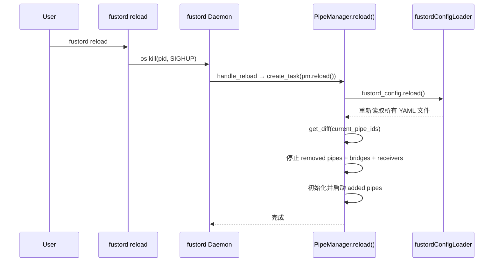

# L3: [workflow] Fustord 热重载机制 (Hot Reload)

> Type: workflow | algorithm
> 版本: 1.0.0

## 1. 概述

Fustord 支持 **基于 SIGHUP 信号的配置热重载**，允许在不停止服务的情况下动态增减管道（Pipe）。

> [!IMPORTANT]
> **设计硬约束**：热重载**禁止修改**任何已运行组件（不局限于 Pipe）的配置。只能**增加或删除**组件。
> 若需变更已运行组件的配置，必须先删除该组件再重新添加（通过改 Pipe ID 实现）。

---

## 2. 使用方式

```bash
# 修改 YAML 配置后，执行：
fustord reload
```

该命令通过读取 PID 文件找到守护进程，然后发送 `SIGHUP` 信号。

---

## 3. 执行流程



**Receiver 清理**：如果某个端口上的所有 Pipe 都被移除，对应的 HTTP Receiver 也会被停止。

---

## 4. Diff 算法

```python
def get_diff(current_running_ids: Set[str]) -> Dict:
    new_enabled_ids = {id for id, cfg in all_pipes() if not cfg.disabled}
    return {
        "added":   new_enabled_ids - current_running_ids,
        "removed": current_running_ids - new_enabled_ids,
    }
```

| 场景 | added | removed |
|------|-------|---------|
| 新增 pipe YAML | `{new-pipe}` | `{}` |
| 删除 pipe YAML | `{}` | `{old-pipe}` |
| 修改 pipe 配置（同 ID） | `{}` | `{}` ← **不会被检测到** |
| 禁用 pipe（`disabled: true`） | `{}` | `{disabled-pipe}` |
