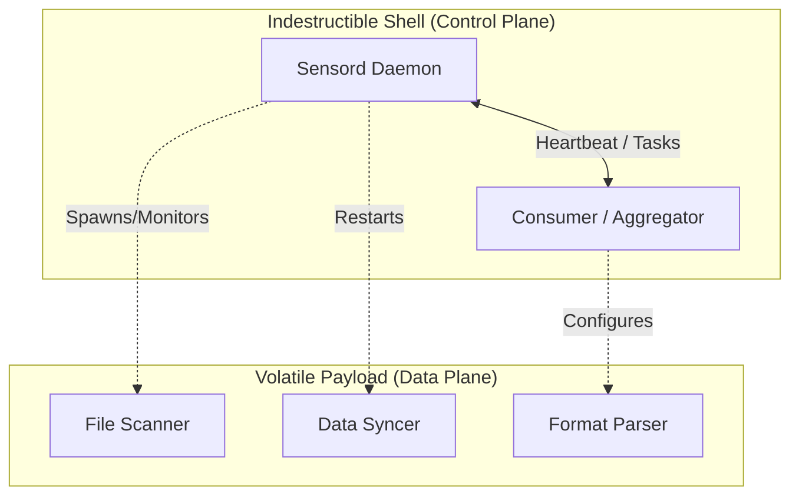

# L0: [Sensord] Project Vision

> **Core Purpose**: Define the strategic vision for the independent **Sensord** project, a standalone distributed sensor and synchronization engine.
> All spec statements must trace back to items defined here.

## VISION.SCOPE

**Sensord** is a standalone, autonomous distributed data synchronization engine. It is designed to be consumed by various aggregators, management platforms, or specialized data processors (collectively referred to as **Consumers**).

### In-Scope (Sensord - The Standalone Project)
- **AUTONOMY**: Sensord is a self-contained process that detects and buffers data changes independently of any consumer.
- **SYNC**: Real-time and periodic data extraction from heterogeneous storage (NFS, OSS, etc.)
- **RESILIENCE**: Sensord process runs indefinitely; the control plane ("The Shell") is immune to data plane failures.
- **PROTOCOL**: Standardized decoupling of Control Protocol (SCP) and Data Protocol (SDP) allowing multiple concurrent consumers.
- **MANAGEMENT**: Support for remote fleet management (upgrade, config reload) via standardized command interfaces and SCP.

#### Consumer Integration (Generic Expectations)
- **AGGREGATION**: Consumers may perform multi-source consistency arbitration.
- **AVAILABILITY**: Consumers ensure high-availability metadata views through on-demand polling.
- **ORCHESTRATION**: Consumers may perform remote fleet management, upgrades, and configuration hot-reloading.

### Out-of-Scope
- **STORAGE**: Sensord does NOT store user data; it indexes and synchronizes metadata.
- **REPLICATION**: Sensord does NOT replicate file contents; it synchronizes state views.
- **USER_AUTH**: End-user management is handled by upper layers; Sensord uses machine-to-machine pipe authorization.

## VISION.STABILITY

> "The Control Plane must survive the Data Plane."

The fundamental architectural goal of **Sensord** is the **absolute decoupling of Control and Data flows**.

- **Sensord_SURVIVAL**: Once the Sensord process starts, it **MUST NOT** terminate due to business logic errors, data corruption, or driver failures. It is an "immortal" guardian.
- **UMBILICAL_CORD**: As long as the Control Plane (Heartbeat, Tasks, Status) remains intact, the system possesses infinite repair potential:
  1. **Self-Repair**: The Control Plane can remotely restart or reset a crashed Data Plane.
  2. **Hot Upgrade**: Sensord can receive software updates and perform atomic in-place replacement.
  3. **Config Hot-Reload**: Update business logic dynamically without interrupting the process.

## VISION.LIFECYCLE

**Sensord** 产品的生命周期由 **Stability Layer** 托管。通过 SCP 协议，实现对 Session、Pipe 以及进程本身的完整闭环管理。

- **Atomic Lifecycle**: 无论是升级、配置重载还是会话重建，系统必须保证状态切换的原子性。
- **Graceful Termination**: 任何组件的销毁都必须符合资源回收规范，保证数据面与控制面的双重整洁。

---

## VISION.AUTONOMY

**Sensord** 是一套独立的软件系统，推崇 **"感知驱动，按需对齐"** 的自主模型：

- **INTRINSIC_DRIVE**: Sensord 绝非被动等待命令的傀儡，而是一个**主动的、有状态的传感器**。它根据自身配置，自主监听本地变化并主动寻找消费者信道进行推送。
- **INDEPENDENT_LIFECYCLE**: Sensord 的生存不依赖于特定消费者。在断网或消费者故障时，Sensord 本地感知逻辑全速运行，事件在本地缓冲区排队。
- **MULTI_TARGET_RENTING**: Sensord 可同时向多个不同的消费者或三方工具推送数据。
- **UNIVERSAL_PROTOCOL**: Sensord 采用通用的基于 HTTP/JSON 的通信协议。

---

## VISION.CONCURRENCY

**Sensord** 采用单线程事件循环（Asyncio）驱动核心业务逻辑，辅以多线程/多进程隔离阻塞式 I/O。

- **Liveness Guarantee**: 控制面（心跳与指令）具备绝对优先级，不受数据面 I/O 阻塞。
- **Order Consistency**: 通过线性执行模型，消除复杂锁竞争带来的不确定性。

---

## VISION.DATA_ROUTING

实现数据源（Source）与消费者（Consumer）之间的多对多路由。

- **Schema Driven**: 基于语义化的数据契约（Schema）而非物理路径。
- **Universal Projection**: 支持在传输过程中进行字段投影与过滤。

---

## VISION.ADDRESSING

定义集群中节点的唯一标识（UDID）与定点指令分发机制（Unicast/Broadcast）。

---

## VISION.TESTING

**Sensord** 作为一个高可靠系统，其代码质量必须通过严格的“影子测试（Shadow Testing）”与契约对账验证。

---

## VISION.LAYER_INDEPENDENCE

维持项目的 **Thin Core** 架构。各功能层级（Stability, Domain, Management）具备严格的单向依赖关系，支持按需裁剪安装。

### Architecture of Separation

- **The Shell**: Responsible ONLY for authentication, network connectivity (Heartbeat), and process orchestration.
- **The Payload**: Responsible for the actual "work" (FileSystem watching, Database querying, HTTP requests). If the Payload crashes, the Shell detects it, reports it to the Consumer, and awaits instructions.

## VISION.EXPECTED_EFFECTS

远程操作必须保证 **Sensord** 作为一个整体的原子性与一致性。

### Hot Upgrade
- **精准下发 (Targeted)**: 对于多连接 (Multi-Pipe) 的 Sensord 进程，升级指令应具备针对性。无论多少个 Session 活跃，Sensord 仅响应一次升级触发，完成全局自置换。
- **透明恢复**: 升级后，Sensord 自动恢复所有已配置的业务连接。

### Config Hot-Reload
- **全局生效 (Process-Wide)**: 新配置必须在 Sensord 所有组件中同步生效。
- **无感应用**: 配置更新秒级完成，不中断长连接或采集任务。

### On-Command Find (Data Complement)
- **按需扫描**: 当消费者发起扫描指令时，Sensord 执行即时递归扫描，确保零数据盲区。
- **确定性时延**: 通过并发控制和超时保障，在可控时延内返回完整结果。

## VISION.PROTOCOL_DECOUPLING

Sensord formally separates its communication into two distinct protocols:

### 1. Sensord Control Protocol (SCP)
- **Layer**: Stability Layer.
- **Purpose**: Survival & Orchestration. Handles Session handshakes, heartbeat maintenance, node addressing, and high-priority control commands (upgrade, reload, kill).
- **Invariant**: SCP remains opaque to data content. It ensures the "umbilical cord" exists regardless of what data is being synced.

### 2. Sensord Data Protocol (SDP)
- **Layer**: Domain Layer.
- **Purpose**: Data Contract & Consistency. Defines event schemas, change semantics (mtime, size), and consistency metadata (Atomic Write, Audit flags).
- **Invariant**: SDP is extensible and schema-driven (e.g., `sensord-schema-fs`).

## VISION.SUCCESS_CRITERIA

- **UPTIME**: `Sensord` 进程连续运行时间以**月**计量，即使底层驱动频繁重置。
- **REMOTE_RECOVERY**: 消费者可通过控制面诊断“僵尸任务”并远程下达修复指令。
- **ZERO_TOUCH**: 运维无需 SSH 到节点。配置与更新均通过协议在线完成。

## VISION.UBIQUITOUS_LANGUAGE

| Term | Definition |
|------|------------|
| Sensord | 部署在数据节点上的独立自主传感器进程 |
| Consumer | 消费 Sensord 数据并提供聚合、展现或管理指令的外部实体 |
| Pipe | Sensord 与 Consumer 之间的逻辑数据信道 |
| Source | 数据产出驱动（Sensord 侧） |
| Session | 建立在 Pipe 之上的具体业务会话 |
| Heartbeat | 用于生存检测与指令下发的双向信道 |
| Schema | 数据契约/格式标识（如 `fs`） |
| Leader | 涉及多节点同步时，负责主动触发扫描的角色 |
| Sentinel | 周期性的一致性校验机制 |
