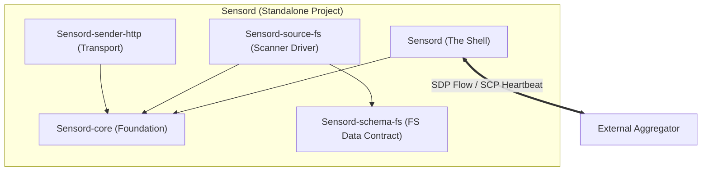

# L2: [Sensord] System Architecture

> This document defines the high-level component structure of **Sensord**.
> **Subject**: Role (Active) | Component (Passive)
> - Role: Observes / Decides / Acts
> - Component: Input / Output

---

## COMPONENTS.LAYER_MODEL

### 三层垂直模型 (SCP/SDP Separation)

```mermaid
graph TD
    subgraph "Sensord Domain Layer (核心业务 - SDP)"
        sensordSource["Source Drivers (FS/SQL/etc.)"]
        sensordCore["Sensord-core (ABCs/Events)"]
        SDP["Sensord Data Protocol"]
    end

    subgraph "Sensord Stability Layer (稳定性层 - SCP)"
        SensordPipe["sensordPipe (Lifecycle/Heartbeat)"]
        EventBus["EventBus (Memory Buffer)"]
        Sender["Sender Drivers (HTTP/gRPC)"]
        BaseMgr["sensord-core (BasePipeManager)"]
        SCP["Sensord Control Protocol"]
    end

    %% Dependencies
    SensordPipe <==>|SCP (Umbilical Cord)| Consumer["External Consumer (Aggregator)"]
    SensordPipe ---|Spawns/Monitors| sensordSource
    sensordSource ---|SDP (Data Contract)| EventBus
    EventBus ---|Drained by| SensordPipe
    SensordPipe ---|Uses| Sender
```

### Layer Definitions

**Sensord** 采用 **"下沉稳定性，上行扩展性"** 的三层垂直模型：

#### Stability Layer (Stability & Session)
- **职责**: 纯粹的连接维护。负责管道 (Pipes)、生存隧道 (Umbilical Cord)、生命体征监控。
- **中立原则**: Stability Layer 只提供**寻址原语** (Unicast / Broadcast)。不感知业务逻辑。
- **愿景定位**: 系统的"生存地基"。

#### Domain Layer (Domain & Data)
- **职责**: 定义数据的"血肉"。包括 Source 驱动、快照生成、事件索引维护。
- **自治原则**: 驱动本地数据的感知与其生命周期。
- **层级借用**: Domain Layer 通过调用 Stability Layer 的中立原语来实现数据发送。

#### Management Layer (Operations & Plugins)
- **职责**: 非实时管理工作（升级、状态报告插件）。
- **独立原则**: Management 层必须是插件化实现。移除后，核心同步能力必须保持可用。

---

### 2.2 Package Topology (Sub-system Mapping)



### 2.3 Component Mapping
| Original Package | New Standalone Identity | Role |
|------------------|-------------------------|------|
| `sensord-core` | `sensord-core` | Foundation ABCs & Models |
| `sensord` | `sensord` | Process Guardian (SCP/SDP Orchestrator) |
| `fustor-source-fs` | `sensord-source-fs` | FS Scanner Driver |
| `fustor-schema-fs` | `sensord-schema-fs` | FS Event Schema (SDP Implementation) |
| `fustor-sender-*` | `sensord-sender-*` | Network Transporters |

---


## COMPONENTS.CORE

Core components that implement primary functionality.


---

## COMPONENTS.TOPOLOGY

### COMPONENTS.TOPOLOGY.INGESTION

#### sensord 侧数据流向 (SDP Transmission)

```
┌─────────────────────────────────────────────────────────────────────────────────────┐
│                                                                                      │
│   sensord Node                                                                       │
│   ───────────                                                                        │
│                                                                                      │
│   Source-A ──┬── sensordPipe-1 ──┬── Sender (HTTP) ──▶ Consumer A (SDP)              │
│   Source-B ──┘                   └── Sender (HTTP) ──▶ Consumer B (SDP)              │
│                                                                                      │
│   约束: <source, sender> 组合唯一 (由 sensordPipe 负责生命周期维护)                     │
│                                                                                      │
└─────────────────────────────────────────────────────────────────────────────────────┘
```

### COMPONENTS.TOPOLOGY.EVENT_BUS (SDP Buffer)

#### sensord 异步采集架构

**Component**: EventBus-based message synchronization.

```
┌─────────────────────────────────────────────────────────────────────────────────────┐
│                              sensord 消息同步架构                                       │
├─────────────────────────────────────────────────────────────────────────────────────┤
│                                                                                      │
│   ┌──────────────┐         ┌─────────────────┐         ┌──────────────┐             │
│   │  Local Watch │────────▶│    EventBus     │────────▶│  sensordPipe   │──▶ Consumer  │
│   │   Thread     │  put()  │   (MemoryBus)   │get()    │  Broadcaster   │    (SDP)     │
│   └──────────────┘         └─────────────────┘         └──────────────┘             │
│         │                         │                                                  │
│         │                    ┌────┴────┐                                ▶  SCP Task │
│         │               subscriber1  subscriber2                        │  (Scan..) │
│       异步入队              (Pipe-1)   (Pipe-2)                         │           │
│       (不阻塞)                                                         ◀── SCP HB   │
│                                                                                      │
│   特性:                                                                              │
│   1. 生产者-消费者完全解耦: 数据读取线程不被网络推送延迟阻塞                                │
│   2. 全局/按源共享 EventBus: 节省内存与文件系统句柄资源                                    │
│   3. 反向命令隧道 (SCP): 消费者通过 Heartbeat 响应下发控制指令                             │
│   4. 背压控制: 内部环形缓冲区防止 OOM，支持订阅者落后自动分裂                              │
│                                                                                      │
└─────────────────────────────────────────────────────────────────────────────────────┘
```

---

## COMPONENTS.SESSION (SCP Protocol)

### Session (Lease) 定义

Session 是 **sensord** 与 **Consumer** 之间通过 **SCP** 建立的业务租赁关系。

### Session 生命周期 (Standalone Perspective)

```
sensord 启动
    │
    ├── SCP Handshake ───────────────────────▶ Consumer 验证端点与凭证
    │   POST /api/v1/pipe/sessions/              │
    │   {task_id, schema, ...}                   ▼
    │                                       Consumer 锁定资源，颁发 Lease
    │                                            │
    │◀── 200 {session_id, timeout_seconds} ─────┤
    │                                            │
    ▼                                            ▼
SDP 事件推送 (携带 session_id)                 Consumer 处理数据
SCP 心跳 (间隔 = timeout_seconds / 2)          Consumer 刷新 Lease 有效期
    │                                            │
    ▼                                            ▼
sensord 停止 或 网络断开                      Lease 过期处理
    │                                            │
    └── DELETE /sessions/{id} ──────────────────▶│ Consumer 处理收尾逻辑
                                                 │ 
```

---

## COMPONENTS.CONFIG

### sensord 目录结构与配置

**Component**: 配置管理子系统。
- **Input**: `$SENSORD_HOME` 下的 YAML 文件 (sources, senders, pipes)
- **Output**: 类型安全的配置对象 (Pydantic Models)

**Root Path**: `$SENSORD_HOME` (default: `/etc/sensord`)

```
$SENSORD_HOME/
├── sources-config.yaml              # 存储源定义 (SDP Provider)
├── senders-config.yaml              # 发送器定义 (SCP Transport)
└── pipes-config/                    # 绑定关系 (source ID <-> sender ID)
    └── pipe-*.yaml
```

> 具体 YAML 格式与字段定义见 [CONFIG_PATTERN.md](./L3-RUNTIME/CONFIG_PATTERN.md)。

---

## COMPONENTS.PROTOCOL (SCP & SDP)

**Component**: 协议接口层。
- **Input**: SCP 控制帧 (Heartbeat, Handshake), SDP 数据帧 (Batched Events)
- **Output**: Session 管理, 事件投递确认

sensord 期望消费端实现以下最小符合性接口：

| 功能 | 协议 | 方向 |
|------|------|------|
| Session 创建/销毁 | SCP | sensord → Consumer |
| 数据事件推送 | SDP | sensord → Consumer |
| 心跳 + 指令下发 | SCP | 双向 |
| 远程管理 (升级/重载) | SCP | Consumer → sensord |

> 具体 API Path、Payload 格式及指令集见 [PROTOCOL_CARRIER.md](./L3-RUNTIME/PROTOCOL_CARRIER.md) 和 [COMMAND_PROTOCOL.md](./L3-RUNTIME/COMMAND_PROTOCOL.md)。

---

## COMPONENTS.AUTONOMY (Peer-to-Peer Model)

Sensord 采用 **Peer-to-Peer** 协作模型，而非简单的被动执行模型：

*   **租用模型 (Renting)**: Sensord 视外部系统为“信道提供方”。当需要发布数据时，通过 SCP 启动一个租约进程（Session）。
*   **生存隔离**: 底层 `Stability Layer` 必须在逻辑上隔离各 Session。
*   **控制与数据解耦**: SCP 维持生存，SDP 维持契约。两者在协议层面互不干扰。

### 9.1 Unified Renting Model (Task Types)

Sensord 作为租户，通过 Stability Layer (SCP) 接收两种类型的任务租约：

#### 1. Broadcast Task (内容补偿)
- **场景**: `scan` (On-Demand Find)
- **行为**: Aggregator 广播给同一 View 的所有 Sensord。
- **Sensord 职责**: 执行只读扫描，通过 SDP 回传数据。

#### 2. Targeted Task (状态变更)
- **场景**: `upgrade`, `reload`, `stop`
- **行为**: Aggregator 单播给特定 task_id 的 Sensord。
- **Sensord 职责**: 执行自身状态变更或重启。
