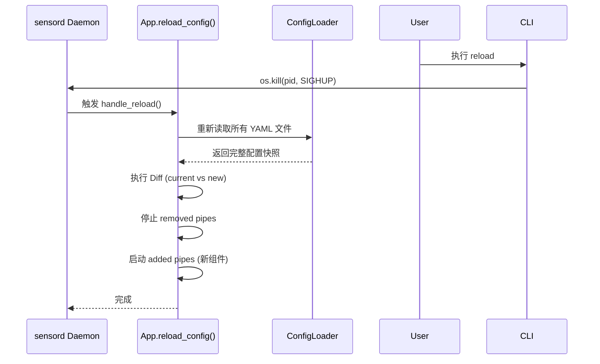

# L3: [algorithm] [Sensord] Hot Reload Mechanism

> Type: algorithm | operational_spec
> Layer: Stability Layer (SCP Implementation)

---

## 1. 触发机制 (Trigger)

**Sensord** 支持不重启进程的情况下更新业务配置。
- **信号**: `SIGHUP` (Signal Hang Up)。
- **CLI**: `Sensord reload` (通过发送 SIGHUP 到 PID 实现)。

---

## 2. 执行流程 (Execution Flow)

当 **Sensord** 接收到重载信号时，执行以下原子操作：

### 2.1 重新解析 (Re-parsing)
- 重新读取 `$SENSORD_HOME` 下的所有 YAML 配置文件。
- 校验配置合法性。若新配置非法，**保持旧配置运行**并向日志系统发出告警。

### 2.2 差异对账 (Diff Algorithm)
Sensord 对比 `OldState` 与 `NewState` 的差异：

| 变更类型 | 动作 (Action) |
|----------|---------------|
| **New Pipe** | 立即解析并启动新的 `SensordPipe` 任务。 |
| **Removed Pipe** | 优雅关闭该 `SensordPipe`（发送 `DELETE /session`）。 |
| **Modified Config** | 更新已有 `SensordPipe` 的参数（如 `audit_interval`），无需断开 Session。 |
| **Modified URI** | 销毁旧 `SensordPipe` 及其 Driver，重建新任务。 |

---

## 3. 热升级准则 (Best Practices)

1.  **静默更新**: 重载期间，`EventBus` 中的存量数据不得丢失。
2.  **句柄复用**: 对于 URI 未变更的 Driver，必须保持物理连接（如 NFS Mount 或 SQL Connection），仅更新引用。
3.  **最终一致**: 重载完成后，Sensord 会自动触发一次 Audit 扫描以抹平窗口期的状态差异。



**关键执行特征**：
- **无等待升级**: 旧 Pipe 的停止与新 Pipe 的启动在同一个事件循环周期内完成，通常耗时 < 100ms。
- **状态保留**: EventBus 中已缓存但尚未发送的事件在 Pipe 重新启动前后会被保留（取决于 Driver 缓存策略）。

---

## 4. 差分算法 (Diff Algorithm)

sensord 内部通过以下逻辑计算变更：

```python
def get_diff(current_running_ids: Set[str]) -> Dict:
    # 过滤出所有 active 的配置 ID
    new_enabled_ids = {id for id, cfg in all_pipes() if not cfg.disabled}
    return {
        "added":   new_enabled_ids - current_running_ids,
        "removed": current_running_ids - new_enabled_ids,
    }
```

| 场景 | `added` | `removed` |
|------|:-------:|:---------:|
| 新增 pipe YAML | `{new-id}` | `{}` |
| 删除 pipe YAML | `{}` | `{old-id}` |
| 修改配置（保持 ID 不变） | `{}` | `{}` ← **无效，需重启** |
| 禁用 pipe (`disabled: true`) | `{}` | `{id}` |

---

## 5. 配置更新最佳实践

### 5.1 修改现有任务 (Update Strategy)

为确保新参数生效，建议采用“改 ID”策略：

```yaml
# 修改前 (pipe-a.yaml)
id: pipe-a
source: nfs-share

# 修改后 (强制触发重载)
id: pipe-a-v2       # 通过 ID 变更，确保 Diff 命中 Added/Removed
source: nfs-share
driver_params:
  throttle_interval: 2.0
```

---

## 6. 与驱动单例的交互

`FSDriver` 实例与热重载的深度解耦：
1. `pipe.stop()` 触发时，若该 Driver 不再被任何其他活跃 Pipe 使用（虽然目前 sensord 配置级别不维护 RC，但 Driver 显式 `.close()` 会注销资源）。
2. `pipe.start()` 触发时，若 Driver 已被 `close()`，则重新执行 `os.scandir` 全量预热并申请新的 inotify 描述符。
3. 这种机制确保了在修改 `exclude_patterns` 等敏感参数后，重载能产生完全干净的监控环境。
