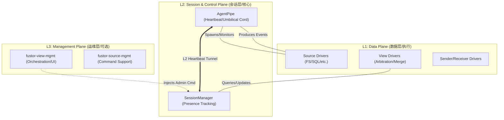

# Fustor 架构设计 V2

> 版本: 2.0.0  
> 日期: 2026-02-01  
> 状态: 设计中

## 1. 设计目标

### 1.1 核心原则

1. **完全松耦合**: Agent 和 Fusion 完全独立，第三方可单独使用任一端
2. **对称架构**: Agent 与 Fusion 的概念一一对应
3. **分层清晰**: 参考 Netty 架构，职责分离
4. **可扩展**: 支持多协议、多 Schema

### 1.2 术语对称表

| Agent 概念 | 职责 | Fusion 对应 | 职责 |
|-----------|------|------------|------|
| **Source** | 数据读取实现 | **View** | 数据处理实现 |
| **Sender** | 传输通道（协议+凭证） | **Receiver** | 传输通道（协议+凭证） |
| **AgentPipe** | 运行时绑定 (Source→Sender) | **FusionPipe** | 运行时绑定 (Receiver→View) |

---

## 2. 核心架构分层 (L1/L2/L3 模型)

Fustor 采用 **控制面与数据面解耦** 的三层架构，确保“控制面幸存于数据面”：



### 2.1 垂直分层模型 (Stability Underneath, Extensibility Above)

Fustor 采用 **“下沉稳定性，上行扩展性”** 的三层垂直模型，严禁次序颠倒：

1.  **Layer 1: 稳定性与会话层 (Stability Layer)**
    *   **核心组件**: `fustor-fusion` (core pipes), `fustor-agent` (core tunnel)。
    *   **职责**: 纯粹的物理连接维持、心跳隧道（Umbilical Cord）、生存状态监控。
    *   **原则**: **中立性 (Neutrality)**。L1 只提供寻址原语（Unicast/Broadcast），严禁感知具体的业务指令或管理操作。

2.  **Layer 2: 领域与数据层 (Domain Layer)**
    *   **核心组件**: `fustor-core` (drivers), `view-fs`, `source-fs`。
    *   **职责**: 定义数据的“血肉”，包括数据同步、快照合并、API 核心查询逻辑。
    *   **原则**: **自主性与补偿性**。通过租用 L1 的寻址原语实现 Fallback 回退扫描。

3.  **Layer 3: Management Layer (Optional Plugins)**
    *   **Packages**: `fustor-view-mgmt`, `fustor-source-mgmt`。
    *   **职责**: 非关键路径的管理工作（升级、迁移、UI 服务）。
    *   **原则**: **可选性**。L3 必须作为 L1/L2 的标准化借用者（Client）。

### 2.2 Peer-to-Peer 自主模型 (Peer-to-Peer Autonomy Model)

Fustor 将 Agent 和 Fusion 视为 L1 稳定性层的 **平等租户 (Peer Tenants)**，而非主从关系：

*   **主动感知 (Proactive)**: Agent 拥有原生的领域冲动（L2），会根据配置自主启动监听并租用 L1 管道推送数据。它不需要 Fusion 的“启动命令”。
*   **对等对称**: 双方使用相同的 L1 原语进行通信。区别仅在于 L2 驱动的类型：一端是 **感知源 (Source)**，另一端是 **聚合视图 (View)**。
*   **生存隔离**: 管理行为（L3）的失效不应影响数据面（L2）的自主同步与生命体征（L1）。

---

## 3. 包结构

### 3.1 核心包

```
extensions/
├── fustor-core/                     # 核心抽象层
│   └── src/fustor_core/
│       ├── common/                  # 通用工具 (原 fustor-common)
│       │   ├── logging.py
│       │   ├── daemon.py
│       │   ├── paths.py
│       │   └── utils.py
│       ├── event/                   # 事件模型 (原 fustor-event-model)
│       │   ├── base.py              # EventBase
│       │   └── types.py             # EventType, MessageSource
│       ├── pipe/                # Pipe 抽象
│       │   ├── pipe.py          # FustorPipe ABC
│       │   ├── context.py           # PipeContext
│       │   └── handler.py           # Handler ABC
│       ├── transport/               # 传输抽象
│       │   ├── sender.py            # Sender ABC
│       │   └── receiver.py          # Receiver ABC
│       ├── clock/                   # 时钟 (通用，不依赖特定 Schema)
│       │   └── logical_clock.py
│       ├── config/                  # 配置模型
│       │   └── models.py
│       └── exceptions.py
│
├── fustor-agent-sdk/                # Agent 开发 SDK
├── fustor-fusion-sdk/               # Fusion 开发 SDK
```

### 3.2 Schema 包

```
extensions/
├── fustor-schema-fs/                # 文件系统 Schema
│   └── src/fustor_schema_fs/
│       ├── __init__.py
│       ├── event.py                 # FSEventRow (Pydantic 模型)
│       └── version.py               # SCHEMA_NAME, SCHEMA_VERSION
```

### 3.3 Handler 包 (Source/View)

```
extensions/
├── fustor-source-fs/                # FS Source Driver
├── fustor-source-oss/               # OSS Source Driver
├── fustor-view-fs/                  # FS View Driver (含一致性逻辑)
│   └── src/fustor_view_fs/
│       ├── handler.py               # FSViewHandler
│       ├── arbitrator.py            # 一致性仲裁 (fs 特有)
│       ├── state.py                 # Suspect, Blind-spot, Tombstone
│       └── nodes.py                 # 内存树节点
```

### 3.4 Transport 包 (Sender/Receiver)

```
extensions/
├── fustor-sender-http/              # HTTP Sender (原 pusher-fusion)
├── fustor-sender-grpc/              # gRPC Sender (新增)
├── fustor-receiver-http/            # HTTP Receiver (从 fusion 抽取)
├── fustor-receiver-grpc/            # gRPC Receiver (新增)
```

### 3.5 FSDriver Singleton Lifecycle

为节省系统资源（如 inotify watch 描述符），FSDriver 实现了 **Per-URI Singleton** 模式。

-   **唯一标识**: `signature = f"{uri}#{hash(credential)}"`
-   **行为**:
    -   不同 AgentPipe 配置若指向同一 URI 且凭证相同，将共享同一个 Driver 实例。
    -   共享实例意味着共享底层的 WatchManager 和 EventQueue。
-   **生命周期约束**:
    -   **引用计数**: Driver 内部不维护引用计数（简化设计）。
    -   **显式销毁**: 必须调用 `driver.close()` 或 `FSDriver.invalidate(uri, cred)` 才能从缓存中移除。
    -   **热重载**: 修改配置（如排除列表）但 URI 不变时，为了使新配置生效，ConfigReloader 必须显式 `invalidate` 旧实例，否则下次 `FSDriver(id, config)` 仍会返回旧实例。

### 3.6 应用包

```
agent/                               # fustor-agent
fusion/                              # fustor-fusion
```

---

## 4. 组件关系

### 4.1 关系基数

```
┌─────────────────────────────────────────────────────────────────────────────────────┐
│                                                                                      │
│   Agent 侧                                                                           │
│   ─────────                                                                          │
│                                                                                      │
│   Source ──┬── AgentPipe ──┬── Sender                                          │
│   Source ──┘               └── Sender                                          │
│                                                                                      │
│   约束: <source, sender> 组合唯一 (同一组合只能启动一个 AgentPipe)                 │
│                                                                                      │
│   ─────────────────────────────────────────────────────────────────────────────────  │
│                                                                                      │
│   Fusion 侧                                                                          │
│   ──────────                                                                         │
│                                                                                      │
│   Receiver (1) ─── FusionPipe (N) ─── View (N)                                   │
│       │                  │                │                                          │
│       │                  └────────────────┘                                          │
│       │                         │                                                    │
│   API Key (1:N)           见下图详解                                                  │
│                                                                                      │
└─────────────────────────────────────────────────────────────────────────────────────┘
```

### 4.2 Fusion 侧详细关系

```
┌─────────────────────────────────────────────────────────────────────────────────────┐
│                                                                                      │
│   Receiver : FusionPipe = 1 : N                                                  │
│   (一个 Receiver 可服务多个 FusionPipe)                                          │
│                                                                                      │
│   ┌──────────────────┐                                                              │
│   │ Receiver (HTTP)  │───┬──▶ FusionPipe-A ──▶ View-X                           │
│   │ Port: 8102       │   │                                                          │
│   │ API Key: fk_xxx  │   └──▶ FusionPipe-B ──┬──▶ View-X                       │
│   └──────────────────┘                       └──▶ View-Y                       │
│                                                                                      │
│   ─────────────────────────────────────────────────────────────────────────────────  │
│                                                                                      │
│   FusionPipe : View = 1 : N                                                      │
│                                                                                      │
│   View : FusionPipe = N : M                   
│                                                                                      │
└─────────────────────────────────────────────────────────────────────────────────────┘
```

### 4.3 Agent 侧消息同步机制

AgentPipe 使用 EventBus 实现高吞吐低延迟的消息同步。

#### 4.3.1 架构图

```
┌─────────────────────────────────────────────────────────────────────────────────────┐
│                              Agent 消息同步架构                                       │
├─────────────────────────────────────────────────────────────────────────────────────┤
│                                                                                      │
│   ┌──────────────┐         ┌─────────────────┐         ┌──────────────┐             │
│   │  FS Watch    │────────▶│    EventBus     │────────▶│  AgentPipe   │──▶ Fusion   │
│   │   Thread     │  put()  │   (MemoryBus)   │get()    │  Consumer    │             │
│   └──────────────┘         └─────────────────┘         └──────────────┘             │
│         │                         │                                                  │
│         │                    ┌────┴────┐                                ▶  Run      │
│         │               subscriber1  subscriber2                        │  Command  │
│       异步入队              (Pipe-A)  (Pipe-B)                          │  (Scan..) │
│       (不阻塞)                                                         ◀── Heartbeat│
│                                                                                      │
│   特性:                                                                              │
│   1. 生产者-消费者完全解耦 (Source 产生事件不被推送阻塞)                                │
│   2. 200ms 轮询超时 (低负载时延迟 ~0ms, 最坏 200ms)                                   │
│   3. 批量获取已有事件 (有多少取多少, 不等待凑满 batch)                                  │
│   4. 同源 AgentPipe 共享 Bus (节省资源, 减少重复读取)                                  │
│   5. 反向命令通道: Fusion 通过 Heartbeat 响应下发指令 (如 Real-Time Scan)                │
│                                                                                      │
└─────────────────────────────────────────────────────────────────────────────────────┘
```

#### 4.3.2 EventBus 共享机制

同源的多个 AgentPipe 可共享同一个 EventBus：

```
Source Signature = (driver, uri, credential)

Pipe-A (source=fs-research) ──┐
                                  ├──▶ EventBus-1 (signature=fs:/data/research)
Pipe-B (source=fs-research) ──┘

Pipe-C (source=fs-archive)  ────▶ EventBus-2 (signature=fs:/data/archive)
```

每个订阅者独立跟踪消费进度：
- `last_consumed_index`: 已消费的最后一个事件索引
- `low_watermark`: 所有订阅者中最慢的位置 (用于缓冲区清理)

#### 4.3.3 EventBus 自动分裂

当快慢消费者差距过大时，自动分裂：

```
分裂触发条件: 最快消费者领先最慢消费者 >= 95% 缓冲区容量

分裂前:
  EventBus-1 [容量 1000]
    ├── Pipe-A: index=900 (快)
    └── Pipe-B: index=50  (慢)
    差距 = 850 events >= 95% × 1000 = 950? → 触发!

分裂后:
  EventBus-1 (保留) ── Pipe-B (慢消费者)
  EventBus-2 (新建) ── Pipe-A (快消费者)
```

#### 4.3.4 消息同步模式选择

```python
# AgentPipe._run_message_sync() 逻辑
async def _run_message_sync(self):
    # 优先尝试 Bus 模式 (高吞吐)
    if self._bus_service and not self._bus:
        self._bus, position_lost = await self._bus_service.get_or_create_bus_for_subscriber(...)
        if position_lost:
            # 位置丢失，触发补充快照
            asyncio.create_task(self._run_snapshot_sync())
    
    # 选择同步模式
    if self._bus:
        await self._run_bus_message_sync()   # 高吞吐模式
    else:
        await self._run_driver_message_sync()  # 低延迟模式 (后备)
```

| 模式 | 适用场景 | 延迟 | 吞吐 | 资源共享 |
|------|----------|------|------|----------|
| **Bus 模式** | 多 Pipe 同源, 高频事件 | ~200ms | 高 | ✅ 共享 |
| **Driver 模式** | 单 Pipe, 低频事件 | ~0ms | 中 | ❌ 独占 |

---

## 5. Session 设计

### 5.1 Session 定义

Session 是 **AgentPipe** 和 **FusionPipe** 之间的业务会话。

### 5.2 Session 数据结构

```python
@dataclass
class Session:
    session_id: str                    # 唯一会话 ID
    agent_task_id: str                 # AgentPipe 的 task_id
    fusion_pipe_id: str                # FusionPipe ID
    
    # 生命周期
    created_at: datetime
    last_active_at: datetime
    timeout_seconds: int               # 从 Pipe 配置获取
    
    # 状态追踪
    latest_event_index: int            # 断点续传 (Pipe 级别)
    
    # 认证
    receiver_id: str                   # 使用的 Receiver
    client_ip: str
```

### 5.3 Session 生命周期

```
AgentPipe 启动
    │
    ├── Sender.connect() ────────────────────▶ Receiver 验证 API Key
    │   POST /api/v1/pipe/sessions/              │
    │   {task_id: "..."}                         ▼
    │                                       FusionPipe 创建 Session
    │                                            │
    │◀── 200 {session_id, timeout_seconds} ─────┤
    │                                            │
    ▼                                            ▼
事件推送 (携带 session_id)                    事件处理
心跳 (间隔 = timeout_seconds / 2)            刷新 last_active_at
    │                                            │
    ▼                                            ▼
Pipe 停止 或 网络断开                     Session 超时检测
    │                                            │
    └── DELETE /sessions/{id} ──────────────────▶│ View.on_session_close()
                                                 │ View 自行决定状态处理
                                                 │ (live 类型清空，否则保留)
```

---

## 6. 一致性设计

### 6.1 组件层级

| 组件 | 层级 | 说明 |
|------|------|------|
| **LogicalClock** | View 级别 | 通用时间仲裁，不依赖特定 Schema |
| **Leader/Follower** | View 级别 | fs 特有，仅 view-fs 实现 |
| **审计周期** | View 级别 | fs 特有，由一致性方案决定哪个 Session 审计 |
| **Suspect/Blind-spot/Tombstone** | View 级别 | fs 特有，仅 view-fs 实现 |

### 6.2 多 Session 并发写入

同一 View 接收多个 Session 的事件时，使用 LogicalClock 仲裁：
- 比较事件的 mtime
- 更新的事件覆盖旧事件
- fs 特有的 Leader/Follower 逻辑在 view-fs 中实现

---

## 7. 配置文件

### 7.1 Agent 配置

```
$FUSTOR_AGENT_HOME/
├── sources-config.yaml              # Source 定义
├── senders-config.yaml              # Sender 定义 (原 pushers-config.yaml)
└── agent-pipes-config/              # AgentPipe 定义 (原 agent-pipes-config/)
    └── pipe-*.yaml
```

#### sources-config.yaml
```yaml
fs-research:
  driver: fs
  uri: /data/research
  enabled: true
  driver_params:
    throttle_interval_sec: 1.0
```

#### senders-config.yaml
```yaml
fusion-http:
  driver: http
  endpoint: http://fusion.local:8102
  credential:
    key: fk_research_key
  driver_params:
    batch_size: 100
```

#### agent-pipes-config/pipe-research.yaml
```yaml
id: pipe-research
source: fs-research
sender: fusion-http
enabled: true
audit_interval_sec: 600
sentinel_interval_sec: 120
```

### 7.2 Fusion 配置

```
$FUSTOR_FUSION_HOME/
├── receivers-config.yaml            # Receiver 定义 (新增)
├── views-config/                    # View 定义
│   └── view-*.yaml
└── fusion-pipes-config/             # FusionPipe 定义 (新增)
    └── pipe-*.yaml
```

#### receivers-config.yaml
```yaml
http-receiver:
  driver: http
  bind: 0.0.0.0
  port: 8102
  credential:
    key: fk_research_key
  driver_params:
    max_request_size_mb: 16
```

#### views-config/fs-research.yaml
```yaml
id: fs-research
driver: fs
enabled: true
live_mode: false                     # false: Session 关闭保留状态
driver_params:
  hot_file_threshold_sec: 300
  blind_spot_style: detect
```

#### fusion-pipes-config/pipe-http.yaml
```yaml
id: pipe-http
receiver: http-receiver
views:                               # 1:N 关系
  - fs-research
  - fs-archive
enabled: true
session_timeout_seconds: 30
```

---

## 8. API 设计

### 8.1 API 路径（已完成迁移）

| 路径 | 用途 |
|--------|--------|
| `/api/v1/pipe/session/` | Session 管理（创建/心跳/关闭） |
| `/api/v1/pipe/{session_id}/events` | 事件推送 |
| `/api/v1/pipe/consistency/*` | 一致性信号（audit_start/end, snapshot_end） |
| `/api/v1/pipe/pipes` | FusionPipe 管理（列表/详情） |
| `/api/v1/views/*` | 数据视图查询 |

> 注：旧路径 `/api/v1/ingest/*` 已移除，不再支持。

### 8.2 Session 创建响应

```json
{
  "session_id": "sess_xxx",
  "timeout_seconds": 30,
  "view_ids": ["fs-research", "fs-archive"]
}
```

Agent 收到响应后，设置心跳间隔为 `timeout_seconds / 2`。

---

## 9. 包依赖图

```
                              fustor-core
                    ┌────────────────┼────────────────┐
                    │                │                │
                    ▼                ▼                ▼
           fustor-agent-sdk   fustor-schema-*   fustor-fusion-sdk
                    │                │                │
          ┌─────────┼────────────────┼────────────────┼─────────┐
          │         │                │                │         │
          ▼         ▼                ▼                ▼         ▼
   fustor-source-*  fustor-sender-*       fustor-receiver-*  fustor-view-*
          │              │                     │              │
          └──────────────┴──────────┬──────────┴──────────────┘
                                    │
                    ┌───────────────┼───────────────┐
                    ▼                               ▼
              fustor-agent                    fustor-fusion
```

---

## 10. 现有模块迁移表

| 现有包 | 未来包 | 变更 |
|--------|--------|------|
| `common` | → `fustor-core/common/` | 合并 |
| `core` | → `fustor-core` | 保留+扩展 |
| `event-model` | → `fustor-core/event/` | 合并 |
| `agent-sdk` | → `fustor-agent-sdk` | 保留 |
| `fusion-sdk` | → `fustor-fusion-sdk` | 保留 |
| (新增) | → `fustor-schema-fs` | 新增 |
| `source-fs` | → `fustor-source-fs` | 保留 |
| `view-fs` | → `fustor-view-fs` | 保留 |
| `pusher-fusion` | → `fustor-sender-http` | 重命名 |
| (新增) | → `fustor-sender-grpc` | 新增 |
| (抽取) | → `fustor-receiver-http` | 抽取 |
| (新增) | → `fustor-receiver-grpc` | 新增 |
| `views-config.yaml` | (废弃) | 废弃 |

---

## 11. 实施计划

### Phase 1: 基础模块重构
1. 合并 `common`, `event-model` 到 `fustor-core`
2. 添加 `pipe/`, `transport/` 抽象层
3. 创建 `fustor-schema-fs`

### Phase 2: 核心业务逻辑
4. 重构 `fustor-agent` Pipe 架构
5. 重构 `fustor-fusion` Pipe 架构
6. 实现 SessionManager 新逻辑

### Phase 3: 驱动重构
7. 重命名 `pusher-fusion` → `fustor-sender-http`
8. 抽取 `fustor-receiver-http`
9. 更新 `source-fs`, `view-fs`

### Phase 4: 测试更新
10. 更新配置文件
11. 更新 API 路径
12. 更新集成测试

---

## 12. 远程命令分发策略 (Remote Command Dispatch Strategies)

Fustor 采用 **“统一租用 (Unified Renting)”** 模式进行指令下发，由 L2（领域层）或 L3（管理层）直接租用 L1（稳定性层）提供的中立原语。

### 12.1 逻辑广播原语 (L1 Primitive: `broadcast`)
*   **适用场景**: `scan` (On-Command Fallback)。
*   **目标层级**: **L2 领域原子性**。
*   **执行逻辑**: 针对对应 ViewID 关联的 **所有物理源** 进行全量覆盖。

### 12.2 物理单播原语 (L1 Primitive: `unicast`)
*   **适用场景**: `upgrade`, `stop`。
*   **目标层级**: **L3 进程原子性**。
*   **执行逻辑**: 针对特定 AgentID 或 SessionID 进行精准触达，确保运维操作的幂等与原子性。

### 12.3 自动重连与恢复
所有远程指令触发的连接中断（如升级、重启）必须由 L2 层（`AgentPipe` 的心跳重连机制）实现自动恢复，确保控制面的“脐带”在物理网络可达的情况下始终处于就绪状态。
