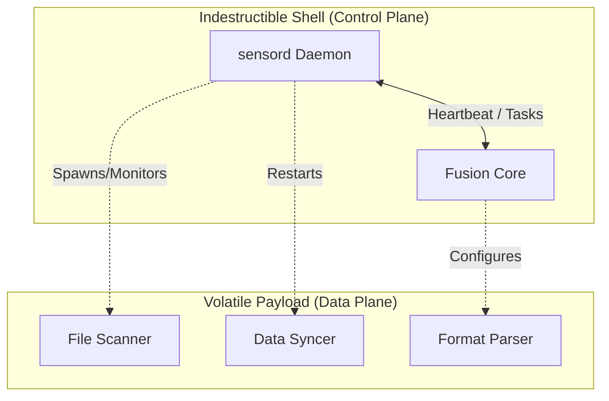

# L0: Fustor Vision

> **Core Purpose**: Define the strategic vision that guides all lower layers (L1-L3).
> All spec statements must trace back to items defined here.

## VISION.SCOPE

Fustor is a distributed data synchronization framework that ensures data consistency across heterogeneous storage endpoints via a real-time event-driven pipeline with autonomous agents.

### In-Scope
- **SYNC**: Real-time and periodic data synchronization across distributed storage (NFS, OSS, etc.)
- **CONSISTENCY**: Multi-source consistency arbitration with Tombstone, Suspect, and Blind-spot mechanisms
- **AVAILABILITY**: API must never return 503 — "Presence is Service" (On-Command Fallback)
- **RESILIENCE**: sensord process runs indefinitely; self-healing on all non-fatal errors
- **MANAGEMENT**: Remote fleet management (upgrade, config reload) as optional plugins
- **EXTENSIBILITY**: Schema-based driver architecture supporting third-party data sources and views

### Out-of-Scope
- **STORAGE**: Fustor does NOT store or persist user data; it indexes and synchronizes metadata
- **REPLICATION**: Fustor does NOT replicate file contents between nodes; it synchronizes state views
- **AUTH**: Fustor does NOT implement end-user authentication; it uses API key-based pipe authorization

## VISION.SURVIVAL

> "The Control Plane must survive the Data Plane."

Fustor 的根本架构目标是 **控制流与数据流的绝对解耦**。

- **AGENT_SURVIVAL**: sensord 进程启动后，**绝不因**业务逻辑错误、数据损坏或插件故障而终止。它本质上是一个不朽守护进程，唯一任务是维持到 Fusion 的生命线。
- **FUSION_SURVIVAL**: Fusion 必须保持对心跳和管理指令的响应，不受数据处理管道或视图一致性逻辑状态的影响。
- **UMBILICAL_CORD**: 只要控制面（心跳、任务分发、状态上报）保持完整，系统就具备无限的修复潜力：
  1. **自我修复 (Self-Repair)**: 控制面可远程重启、重置或重新配置崩溃的数据面。
  2. **热升级 (Hot Upgrades)**: sensord 接收软件版本更新，实现在线自置换。
  3. **配置热重载 (Config Hot-Reload)**: 动态更新业务逻辑，无需重启即可修复故障。

### Architecture of Separation

- **The Shell**: Responsible ONLY for authentication, network connectivity (Heartbeat), and process orchestration.
- **The Payload**: Responsible for the actual "work" (FileSystem watching, Database querying, HTTP requests). If the Payload crashes, the Shell detects it, reports the failure to Fusion, and awaits instructions.

## VISION.EXPECTED_EFFECTS

远程操作必须保证 sensord 作为一个整体的原子性与一致性。

### Hot Upgrade
- **单点触发，进程重启**: 对于多连接 (Multi-Pipe) 的 sensord 进程，升级指令必须具备**精准下发 (Targeted)** 能力。无论多少个 Session 活跃，Fusion 仅触发其中一个，由 sensord 完成全局自置换。
- **透明恢复**: 升级后，sensord 自动恢复所有业务连接。

### Config Hot-Reload
- **全局生效 (Process-Wide)**: 新配置必须在 sensord 所有组件中同步生效。
- **无感应用**: 配置更新秒级完成，不中断长连接或上传任务。

### On-Command Find
- **全量广播 (Broadcast)**: 内存视图失效时，Fusion 向所有活跃源同时下发扫描指令，确保零数据盲区。
- **语义汇聚 (Semantic Aggregation)**: 不同 Source 返回的数据交由 View Driver 汇聚处理。
- **确定性时延**: 通过并发控制和超时保障，在可控时延内返回完整结果。

## VISION.LAYER_MODEL

Fustor 采用 **"下沉稳定性，上行扩展性"** 的三层垂直模型，严禁次序颠倒：

### Stability Layer (Stability & Session)
- **职责**: 纯粹的连接维持。负责物理链接 (Pipes)、心跳隧道 (Umbilical Cord)、生存状态监控。
- **中立原则**: Stability Layer 只提供**寻址原语** (Unicast / Broadcast)。严禁感知业务指令或管理操作，只负责"将二进制包安全送达"。
- **愿景定位**: 系统的"生存地基"。如果 Stability Layer 因感知上层业务而变复杂，生存愿景将丧失。

### Domain Layer (Domain & Data)
- **职责**: 定义数据的"血肉"。包括数据驱动 (Source/View)、快照合并方案、API 核心查询逻辑。
- **自治原则**: API 的"永不 503"保障 (Fallback Scan) 属于 Domain Layer 的**核心本能**，不属于 Management Layer 的外部干预。
- **层级借用**: Domain Layer 通过调用 Stability Layer 的中立广播原语来实现数据补全，无需 Stability Layer 知道补全内容。

### Management Layer (Operations & Plugins)
- **职责**: 非实时、非关键路径的管理工作（升级、迁移、UI 服务）。
- **命名规范**: Fusion 端 `fustor-view-mgmt`，sensord 端 `fustor-source-mgmt`。
- **独立原则**: Management Layer 必须是**真插件**。删除 Management Layer 后，核心 API 服务 (Domain + Stability) 必须正常运行。
- **次序校验**: Stability/Domain 严禁依赖 Management Layer。

## VISION.AUTONOMY

Fustor 拒绝"主从"式命令模型，推崇 **"感知驱动，按需对齐"** 的自主模型：

- **INTRINSIC_DRIVE**: sensord 绝非被动等待 Fusion 命令的傀儡。它是一个**主动的、有状态的传感器**。sensord 的 Domain Layer 根据自身配置，自主监听本地变化并主动寻找 Stability 管道推送。
- **INDEPENDENT_LIFECYCLE**: sensord 的生存不依赖于 Fusion。断网或 Fusion 崩溃时，sensord 感知逻辑 (Domain) 全速运行，事件在 Stability 隧道中排队。
- **MULTI_TARGET_RENTING**: sensord 可同时向多个 Receiver (Fusion、三方工具) 租用 Stability 管道推送数据。只认管道契约，不认行政从属。
- **UNIVERSAL_ADDRESSING**: Stability Layer 仅提供 `broadcast` (全量覆盖) 和 `unicast` (精准触达) 两种寻址原语。任何上层业务（数据回退、远程升级）都必须映射为这两种原语之一。

## VISION.SUCCESS_CRITERIA

- **UPTIME**: `sensord` 进程运行时间以**月**计量，即使 `fustor-source-fs` 每日重启。
- **ZOMBIE_RECOVERY**: Fusion 可通过控制面诊断"僵尸 sensord"（数据面卡死）并远程发出 `kill -9` + `restart` 命令。
- **ZERO_TOUCH**: 无需 SSH。如果错误正则崩溃了 scanner，Fusion 可推送修正正则，sensord Shell 用新配置重启 scanner。
- **FAULT_ISOLATION**: View Engine 的内存泄漏不能影响 Management API。

## VISION.UBIQUITOUS_LANGUAGE

| Term | Definition |
|------|------------|
| sensord | 部署在数据节点上的自主传感器进程 |
| Fusion | 中央聚合与协调服务 |
| Pipe | sensord/Fusion 之间的逻辑数据管道 |
| Source | 数据产出驱动（sensord 侧） |
| View | 数据消费/汇聚驱动（Fusion 侧） |
| Session | sensordPipe 与 FusionPipe 之间的业务会话 |
| Heartbeat | Stability Layer 的生存检测与指令隧道 |
| Schema | 数据契约/格式标识（如 `fs`） |
| Tombstone | 已删除文件的逻辑标记 |
| Suspect | 疑似不完整写入的文件标记 |
| Blind-spot | inotify 未覆盖区域发现的文件标记 |
| Leader | 负责 Snapshot/Audit 同步的选举角色 |
| Follower | 仅负责 Realtime 同步的非选举角色 |
| Sentinel | 周期性哨兵巡检机制 |
| Watermark | 逻辑时钟水位线 |
