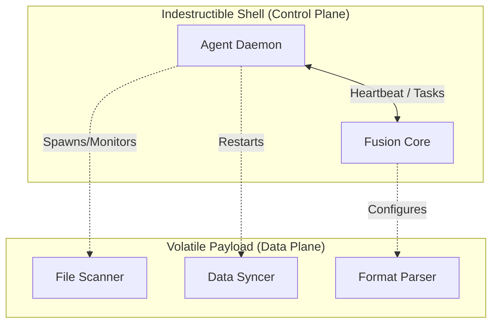

# L0 - Product Vision & Core Philosophy

> "The Control Plane must survive the Data Plane."

## 1. The Core Philosophy: Indestructible Control Plane

The fundamental architectural goal of Fustor is the **absolute decoupling of Control Flow from Data Flow**.

### 1.1 The Survival Mandate
- **Agent Survival**: Once the Agent process starts, it **must never terminate** due to business logic errors, data corruption, or plugin failures. It must essentially be an immortal daemon whose only job is to maintain a lifeline to Fusion.
- **Fusion Survival**: Fusion must remain responsive to heartbeats and administrative commands regardless of the state of data processing pipelines or view consistency logic.

### 1.2 The "Umbilical Cord" Concept
只要 **控制面 (Control Plane)**（心跳、任务分发、状态上报）保持完整，系统就具备无限的修复潜力：
1.  **自我修复 (Self-Repair)**：控制面可以远程重启、重置或重新配置崩溃的数据面（Data Plane）。
2.  **热升级 (Hot Upgrades)**：Agent 能够接收软件版本更新，并实现在线自置换。
3.  **配置热重载 (Config Hot-Reload)**：动态更新业务逻辑（如扫描路径、正则过滤），无需重启服务即可修复配置错误导致的故障。

### 1.3 Expected Effects: 远程管理 (Remote Operations)

远程操作必须保证 Agent 作为一个整体的原子性与一致性。

**期望执行效果 — 软件升级 (Hot Upgrade)**:
- **单点触发，进程重启**: 对于存在多连接 (Multi-Pipe) 的同一个 Agent 进程，升级指令必须具备**精准下发 (Targeted)** 能力。无论有多少个 Session 活跃，Fusion 仅需触发其中一个，由 Agent 进程完成全局自置换，确保不产生资源竞争或重复重启。
- **透明恢复**: 升级后，Agent 进程应当自动恢复所有之前的业务连接 (Pipes)，用户无需手动干预。

**期望执行效果 — 配置重载 (Config Hot-Reload)**:
- **全局生效 (Process-Wide)**: 即使配置是通过某一个特定的管理链路下发的，新配置也必须在 Agent 进程内的所有组件（所有 Pipes、所有 Scanners）中**同步生效**。
- **无感应用**: 配置更新应当在秒级内完成应用，且不应中断现有的长连接或正在进行的上传任务（热压应用）。

### 1.4 API 永不 503 保障 (On-Command Find)

本项目处于关键的核心业务链条上，API 服务 `/fs/tree` **不可以返回 503 状态**，必须时刻可用。这就是 "进程上线即服务可用" (Presence is Service) 原则。

**期望执行效果 — On-Command Find**:
- **全量广播 (Broadcast)**: 当内存视图失效时，Fusion 必须向对应 View 关联的**所有活跃源 (Sessions)** 同时下发扫描指令，确保零数据盲区。每一个 Source 的独立视图都必须被采集。
- **语义汇聚 (Semantic Aggregation)**: 不同 Source 返回的原始数据不应在 Pipe 层面被简单丢弃，而应交由 **View Driver** 根据业务逻辑进行汇聚处理（如 `view-fs` 进行仲裁合并，`view-forest` 进行子树挂载）。
- **确定性时延**: 即使走实时扫描路径，也需通过并发控制和超时保障，在可控时延内返回汇集后的完整结果。

### 1.4 层级独立与接口中立 (Layer Independence & Neutrality)

Fustor 采用 **“下沉稳定性，上行扩展性”** 的三层垂直模型，严禁次序颠倒：

#### **Layer 1: 稳定性与会话层 (Stability Layer - The Indestructible Shell)**
*   **职责**：纯粹的连接维持。负责物理链接（Pipes）、心跳隧道（Umbilical Cord）、生存状态监控。
*   **中立原则**：L1 只提供**寻址原语**（Unicast / Broadcast）。它必须是“语义色盲”，严禁感知具体的业务指令（如 `scan`）或管理操作（如 `upgrade`）。它只负责“将二进制包安全送达”。
*   **愿景定位**：这是系统的“生存地基”，如果这一层逻辑因为感知了上层业务而变得复杂，则生存愿景（"Control plane survives Data plane"）将丧失。

#### **Layer 2: 领域与数据层 (Domain Layer - The Business Content)**
*   **职责**：定义数据的“血肉”。包括数据驱动（Source/View）、快照合并方案、以及 API 的核心查询逻辑。
*   **中立原则**：API 的“永不 503”保障（Fallback Scan）属于 L2 的**核心本能**，不属于 L3 的外部干预。
*   **层级借用**：L2 通过调用 L1 的中立广播原语来实现数据补全，而不需要 L1 知道它在补全什么。

### 1.5 Agent 的自主性与原生冲动 (Agent Autonomy & Intrinsic Drive)

Fustor 拒绝“主从”式的命令模型，推崇 **“感知驱动，按需对齐”** 的自主模型：

1.  **原生冲动 (Intrinsic Drive)**：Agent 绝非被动等待 Fusion 命令的傀儡。它是一个**主动的、有状态的传感器**。Agent 的 L2 层会根据其自身配置，自主监听本地变化并主动寻找 L1 管道进行推送。
2.  **独立生命周期**：Agent 的生存不依赖于 Fusion。在断网或 Fusion 崩溃的情况下，Agent 的感知逻辑（L2）应全速运行，产生的事件在 L1 隧道中自动排队。
3.  **多目标租用**：Agent 作为一个独立实体，可以同时向多个不同的 Receiver（如 Fusion、三方分析工具）租用 L1 管道推送数据。它只认管道契约，不认行政从属。

#### **Layer 3: 运维与插件层 (Management Layer - The Optional Operator)**
*   **职责**：非实时、非关键路径的管理工作（升级、迁移、UI 服务）。
*   **命名规范**：遵循 L2 领域命名，Fusion 端为 `fustor-view-mgmt`，Agent 端为 `fustor-source-mgmt`。
*   **独立原则**：L3 必须是**真插件**。如果删除 L3，核心 API 服务（L2 + L1）必须依然能够正常运行（包括其自动化的 Fallback 扫描能力）。
*   **次序校验**：L1/L2 严禁依赖 L3。目前 API 依赖 `mgmt` 提供的 fallback 逻辑是典型的“次序颠倒”，必须修复。

## 2. Architecture of Separation

To achieve this, the architecture removes **all** business logic from the core Agent/Fusion runtime.

- **The Shell**: Responsible ONLY for authentication, network connectivity (Heartbeat), and process orchestration.
- **The Payload**: Responsible for the actual "work" (FileSystem watching, Database querying, HTTP requests). If the Payload crashes (e.g., Segfault in a native driver, OOM in a parser), the Shell detects it, reports the failure to Fusion, and awaits instructions (Retry, Backoff, or Update Config).

## 3. Benefits

1.  **Zero-Touch Recovery**: No SSH required. If a bad regex crashes the scanner, Fusion can push a corrected regex, and the Agent Shell will restart the scanner with the new config.
2.  **Fault Isolation**: A memory leak in the "View Engine" cannot bring down the "Management API".
3.  **Operational Confidence**: We can deploy aggressive changes to the Data Plane knowing that we can always roll back via the persistent Control Plane.

## 4. Success Criteria
*   The `fustor-agent` process uptime is measured in **months**, even if the `fustor-source-fs` component restarts **daily**.
*   Fusion can diagnose a "Zombie Agent" (Data Plane stuck) via the Control Plane and issue a `kill -9` + `restart` command remotely.
