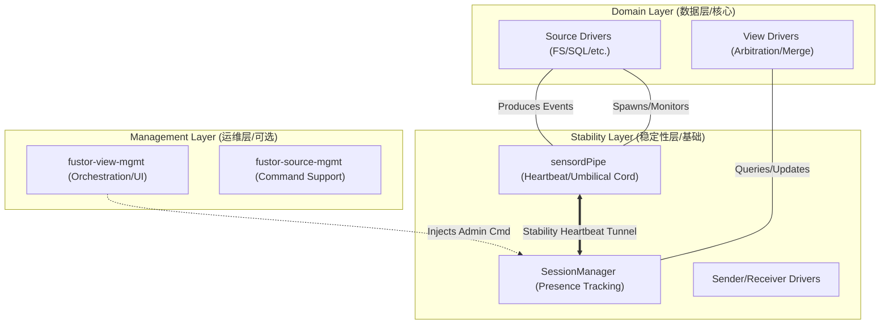

# L2: Fustor Architecture

> This document defines the high-level component structure.
> **Subject**: Role (Active) | Component (Passive)
> - Role: Observes / Decides / Acts (sensord-driven)
> - Component: Input / Output (System)

---

## COMPONENTS.LAYER_MODEL

### 三层垂直模型




---

## COMPONENTS.SYMMETRY

### 术语对称表

| sensord 概念 | 职责 | fustord 对应 | 职责 |
|-----------|------|------------|------|
| **Source** | 数据读取实现 | **View** | 数据处理实现 |
| **Sender** | 传输通道（协议+凭证） | **Receiver** | 传输通道（协议+凭证） |
| **sensordPipe** | 运行时绑定 (Source→Sender) | **fustordPipe** | 运行时绑定 (Receiver→View) |

### 设计原则

1. **完全松耦合**: sensord 和 fustord 完全独立，第三方可单独使用任一端
2. **对称架构**: sensord 与 fustord 的概念一一对应
3. **分层清晰**: 参考 Netty 架构，职责分离
4. **可扩展**: 支持多协议、多 Schema

---

## COMPONENTS.CORE

Core components that implement primary functionality.

### COMPONENTS.CORE.PACKAGES

#### Package Structure

**Component**: Fustor monorepo package organization.

```
extensions/
├── fustor-core/                     # 核心抽象层
│   └── src/fustor_core/
│       ├── common/                  # 通用工具 (原 fustor-common)
│       │   ├── logging.py
│       │   ├── daemon.py
│       │   ├── paths.py
│       │   └── utils.py
│       ├── event/                   # 事件模型 (原 fustor-event-model)
│       │   ├── base.py              # EventBase
│       │   └── types.py             # EventType, MessageSource
│       ├── pipe/                    # Pipe 抽象
│       │   ├── pipe.py              # FustorPipe ABC
│       │   ├── context.py           # PipeContext
│       │   └── handler.py           # Handler ABC
│       ├── transport/               # 传输抽象
│       │   ├── sender.py            # Sender ABC
│       │   └── receiver.py          # Receiver ABC
│       ├── clock/                   # 时钟 (通用，不依赖特定 Schema)
│       │   └── logical_clock.py
│       ├── config/                  # 配置模型
│       │   └── models.py
│       └── exceptions.py
│
├── fustor-sensor-sdk/                # sensord 开发 SDK
├── fustord-sdk/               # fustord 开发 SDK
```

### COMPONENTS.CORE.SCHEMA

#### fustor-schema-fs

**Component**: File system data contract definition.

```
extensions/
├── fustor-schema-fs/                # 文件系统 Schema
│   └── src/fustor_schema_fs/
│       ├── __init__.py
│       ├── event.py                 # FSEventRow (Pydantic 模型)
│       └── version.py               # SCHEMA_NAME, SCHEMA_VERSION
```


### COMPONENTS.CORE.HANDLERS

#### Source/View Handler Packages

**Component**: Data handler implementation packages.

```
extensions/
├── fustor-source-fs/                # FS Source Driver
├── fustor-source-oss/               # OSS Source Driver
├── fustor-view-fs/                  # FS View Driver (含一致性逻辑)
│   └── src/fustor_view_fs/
│       ├── handler.py               # FSViewHandler
│       ├── arbitrator.py            # 一致性仲裁 (fs 特有)
│       ├── state.py                 # Suspect, Blind-spot, Tombstone
│       └── nodes.py                 # 内存树节点
```

### COMPONENTS.CORE.TRANSPORT

#### Transport Packages

**Component**: Protocol-specific transport drivers.

```
extensions/
├── fustor-sender-http/              # HTTP Sender (原 pusher-fustord)
├── fustor-sender-grpc/              # gRPC Sender (新增)
├── fustor-receiver-http/            # HTTP Receiver (从 fustord 抽取)
├── fustor-receiver-grpc/            # gRPC Receiver (新增)
```

### COMPONENTS.CORE.APPLICATION

#### Application Packages

```
sensord/                               # sensord
fustord/                              # fustord
```

---

## COMPONENTS.TOPOLOGY

### COMPONENTS.TOPOLOGY.AGENT

#### sensord 侧关系

```
┌─────────────────────────────────────────────────────────────────────────────────────┐
│                                                                                      │
│   sensord 侧                                                                           │
│   ─────────                                                                          │
│                                                                                      │
│   Source ──┬── sensordPipe ──┬── Sender                                          │
│   Source ──┘               └── Sender                                          │
│                                                                                      │
│   约束: <source, sender> 组合唯一 (同一组合只能启动一个 sensordPipe)                 │
│                                                                                      │
└─────────────────────────────────────────────────────────────────────────────────────┘
```

### COMPONENTS.TOPOLOGY.FUSION

#### fustord 侧关系

```
┌─────────────────────────────────────────────────────────────────────────────────────┐
│                                                                                      │
│   Receiver : fustordPipe = 1 : N                                                  │
│   (一个 Receiver 可服务多个 fustordPipe)                                          │
│                                                                                      │
│   ┌──────────────────┐                                                              │
│   │ Receiver (HTTP)  │───┬──▶ fustordPipe-A ──▶ View-X                           │
│   │ Port: 8102       │   │                                                          │
│   │ API Key: fk_xxx  │   └──▶ fustordPipe-B ──┬──▶ View-X                       │
│   └──────────────────┘                       └──▶ View-Y                       │
│                                                                                      │
│   ─────────────────────────────────────────────────────────────────────────────────  │
│                                                                                      │
│   fustordPipe : View = 1 : N                                                      │
│                                                                                      │
│   View : fustordPipe = N : M                   
│                                                                                      │
└─────────────────────────────────────────────────────────────────────────────────────┘
```

### COMPONENTS.TOPOLOGY.MESSAGE_SYNC

#### sensord 消息同步架构

**Component**: EventBus-based message synchronization.

```
┌─────────────────────────────────────────────────────────────────────────────────────┐
│                              sensord 消息同步架构                                       │
├─────────────────────────────────────────────────────────────────────────────────────┤
│                                                                                      │
│   ┌──────────────┐         ┌─────────────────┐         ┌──────────────┐             │
│   │  FS Watch    │────────▶│    EventBus     │────────▶│  sensordPipe   │──▶ fustord   │
│   │   Thread     │  put()  │   (MemoryBus)   │get()    │  Consumer    │             │
│   └──────────────┘         └─────────────────┘         └──────────────┘             │
│         │                         │                                                  │
│         │                    ┌────┴────┐                                ▶  Run      │
│         │               subscriber1  subscriber2                        │  Command  │
│       异步入队              (Pipe-A)  (Pipe-B)                          │  (Scan..) │
│       (不阻塞)                                                         ◀── Heartbeat│
│                                                                                      │
│   特性:                                                                              │
│   1. 生产者-消费者完全解耦 (Source 产生事件不被推送阻塞)                                │
│   2. 200ms 轮询超时 (低负载时延迟 ~0ms, 最坏 200ms)                                   │
│   3. 批量获取已有事件 (有多少取多少, 不等待凑满 batch)                                  │
│   4. 同源 sensordPipe 共享 Bus (节省资源, 减少重复读取)                                  │
│   5. 反向命令通道: fustord 通过 Heartbeat 响应下发指令 (如 Real-Time Scan)                │
│                                                                                      │
└─────────────────────────────────────────────────────────────────────────────────────┘
```


#### EventBus 共享机制

同源的多个 sensordPipe 可共享同一个 EventBus：

```
Source Signature = (driver, uri, credential)

Pipe-A (source=fs-research) ──┐
                                  ├──▶ EventBus-1 (signature=fs:/data/research)
Pipe-B (source=fs-research) ──┘

Pipe-C (source=fs-archive)  ────▶ EventBus-2 (signature=fs:/data/archive)
```

每个订阅者独立跟踪消费进度：
- `last_consumed_index`: 已消费的最后一个事件索引
- `low_watermark`: 所有订阅者中最慢的位置 (用于缓冲区清理)

---

## COMPONENTS.SESSION

### Session 定义

Session 是 **sensordPipe** 和 **fustordPipe** 之间的业务会话。

### Session 数据结构

```python
@dataclass
class Session:
    session_id: str                    # 唯一会话 ID
    sensord_task_id: str                 # sensordPipe 的 task_id
    fustord_pipe_id: str                # fustordPipe ID
    
    # 生命周期
    created_at: datetime
    last_active_at: datetime
    timeout_seconds: int               # 从 Pipe 配置获取
    
    # 状态追踪
    latest_event_index: int            # 断点续传 (Pipe 级别)
    
    # 认证
    receiver_id: str                   # 使用的 Receiver
    client_ip: str
```

### Session 生命周期

```
sensordPipe 启动
    │
    ├── Sender.connect() ────────────────────▶ Receiver 验证 API Key
    │   POST /api/v1/pipe/sessions/              │
    │   {task_id: "..."}                         ▼
    │                                       fustordPipe 创建 Session
    │                                            │
    │◀── 200 {session_id, timeout_seconds} ─────┤
    │                                            │
    ▼                                            ▼
事件推送 (携带 session_id)                    事件处理
心跳 (间隔 = timeout_seconds / 2)            刷新 last_active_at
    │                                            │
    ▼                                            ▼
Pipe 停止 或 网络断开                     Session 超时检测
    │                                            │
    └── DELETE /sessions/{id} ──────────────────▶│ View.on_session_close()
                                                 │ View 自行决定状态处理
                                                 │ (live 类型清空，否则保留)
```

---

## COMPONENTS.CONSISTENCY

### 组件层级

| 组件 | 层级 | 说明 |
|------|------|------|
| **LogicalClock** | View 级别 | 通用时间仲裁，不依赖特定 Schema |
| **Leader/Follower** | View 级别 | fs 特有，仅 view-fs 实现 |
| **审计周期** | View 级别 | fs 特有，由一致性方案决定哪个 Session 审计 |
| **Suspect/Blind-spot/Tombstone** | View 级别 | fs 特有，仅 view-fs 实现 |

### 多 Session 并发写入

同一 View 接收多个 Session 的事件时，使用 LogicalClock 仲裁：
- 比较事件的 mtime
- 更新的事件覆盖旧事件
- fs 特有的 Leader/Follower 逻辑在 view-fs 中实现


---

## COMPONENTS.CONFIG

### sensord 配置结构

```
$FUSTOR_AGENT_HOME/
├── sources-config.yaml              # Source 定义
├── senders-config.yaml              # Sender 定义 (原 pushers-config.yaml)
└── sensord-pipes-config/              # sensordPipe 定义
    └── pipe-*.yaml
```

#### sources-config.yaml
```yaml
fs-research:
  driver: fs
  uri: /data/research
  enabled: true
  driver_params:
    throttle_interval_sec: 1.0
```

#### senders-config.yaml
```yaml
fustord-http:
  driver: http
  endpoint: http://fustord.local:8102
  credential:
    key: fk_research_key
  driver_params:
    batch_size: 100
```

#### sensord-pipes-config/pipe-research.yaml
```yaml
id: pipe-research
source: fs-research
sender: fustord-http
enabled: true
audit_interval_sec: 600
sentinel_interval_sec: 120
```

### fustord 配置结构

```
$FUSTOR_FUSION_HOME/
├── receivers-config.yaml            # Receiver 定义
├── views-config/                    # View 定义
│   └── view-*.yaml
└── fustord-pipes-config/             # fustordPipe 定义
    └── pipe-*.yaml
```

#### receivers-config.yaml
```yaml
http-receiver:
  driver: http
  bind: 0.0.0.0
  port: 8102
  credential:
    key: fk_research_key
  driver_params:
    max_request_size_mb: 16
```

#### views-config/fs-research.yaml
```yaml
id: fs-research
driver: fs
enabled: true
live_mode: false                     # false: Session 关闭保留状态
driver_params:
  hot_file_threshold_sec: 300
  blind_spot_style: detect
```

#### fustord-pipes-config/pipe-http.yaml
```yaml
id: pipe-http
receiver: http-receiver
views:                               # 1:N 关系
  - fs-research
  - fs-archive
enabled: true
session_timeout_seconds: 30
```

---

## COMPONENTS.API

### API 路径

| 路径 | 用途 |
|--------|--------|
| `/api/v1/pipe/session/` | Session 管理（创建/心跳/关闭） |
| `/api/v1/pipe/{session_id}/events` | 事件推送 |
| `/api/v1/pipe/consistency/*` | 一致性信号（audit_start/end, snapshot_end） |
| `/api/v1/pipe/pipes` | fustordPipe 管理（列表/详情） |
| `/api/v1/views/*` | 数据视图查询 |

### Session 创建响应

```json
{
  "session_id": "sess_xxx",
  "timeout_seconds": 30,
  "view_ids": ["fs-research", "fs-archive"]
}
```

sensord 收到响应后，设置心跳间隔为 `timeout_seconds / 2`。

---

## COMPONENTS.DEPENDENCIES

### 包依赖图

```
                              fustor-core
                    ┌────────────────┼────────────────┐
                    │                │                │
                    ▼                ▼                ▼
           fustor-sensor-sdk   fustor-schema-*   fustord-sdk
                    │                │                │
          ┌─────────┼────────────────┼────────────────┼─────────┐
          │         │                │                │         │
          ▼         ▼                ▼                ▼         ▼
   fustor-source-*  fustor-sender-*       fustor-receiver-*  fustor-view-*
          │              │                     │              │
          └──────────────┴──────────┬──────────┴──────────────┘
                                    │
                    ┌───────────────┼───────────────┐
                    ▼                               ▼
              sensord                    fustord
```

## COMPONENTS.ROLES

### Peer-to-Peer 自主模型

Fustor 将 sensord 和 fustord 视为 Stability Layer 的 **平等租户 (Peer Tenants)**，而非主从关系：

*   **主动感知 (Proactive)**: sensord 拥有原生的领域冲动 (Domain Layer)，会根据配置自主启动监听并租用 Stability 管道推送数据。不需要 fustord 的"启动命令"。
*   **对等对称**: 双方使用相同的 Stability 原语进行通信。区别仅在于 Domain 驱动的类型：一端是 **感知源 (Source)**，另一端是 **聚合视图 (View)**。
*   **生存隔离**: 管理行为 (Management Layer) 的失效不应影响数据面 (Domain Layer) 的自主同步与生命体征 (Stability Layer)。


### COMPONENTS.ROLES.RENTING (Unified Renting Model)

> Source: `2026-02-15-task-dispatch-paradigm.md`

Domain/Management 服务不再拥有专用命令通道，而是统一作为 Client 向 Stability Layer 租用寻址原语。

#### 1. 视图广播任务 (Broadcast Task)
- **目的**: 内容补偿 (Data Compensation)
- **场景**: `scan` (On-Demand Find)
- **租用原语**: `Stability.broadcast(view_id)`
- **成功准则**: Quorum/Full (集齐所有源)
- **失败影响**: 数据盲区 (Partial Data)

#### 2. 代理控制任务 (Targeted Task)
- **目的**: 状态变更 (State Mutation)
- **场景**: `upgrade`, `reload`, `stop`
- **租用原语**: `Stability.unicast(sensord_id)`
- **成功准则**: Any/Single (命中即生效)
- **失败影响**: 管控失效 (Control Loss)

### COMPONENTS.ORCHESTRATION

建议封装通用的 `TaskOrchestrator` 服务，隔离分发细节。

> 详见: `L3-RUNTIME/ORCHESTRATION.md`

### COMPONENTS.ROLES.FSDRIVER

#### FSDriver Singleton Lifecycle

为节省系统资源（如 inotify watch 描述符），FSDriver 实现了 **Per-URI Singleton** 模式。

> 详见: `L3-RUNTIME/DRIVER_LIFECYCLE.md`

---

## COMPONENTS.FIELD_MAPPING

### 字段映射与投影

**Component**: Field-level data transformation between Source and View.

#### 配置格式

```yaml
# sensord 端配置示例
pipes:
  my-sensord-pipe:
    source: shared-fs
    sender: fustord-main
    fields_mapping:
      - to: "path"                    # 目标字段名
        source: ["path:string"]       # 源字段名[:类型转换]
      - to: "modified_time"
        source: ["modified_time:number"]
      - to: "custom_size"
        source: ["size:integer"]      # size → custom_size (重命名)
      - to: "label"
        hardcoded_value: "production" # 硬编码常量
```

**投影语义**:
- 已配置 `fields_mapping`（列表非空）：输出中**仅包含映射规则显式声明的字段**
- 未配置 `fields_mapping`（列表为空或缺省）：透明直通，所有字段原样传输

